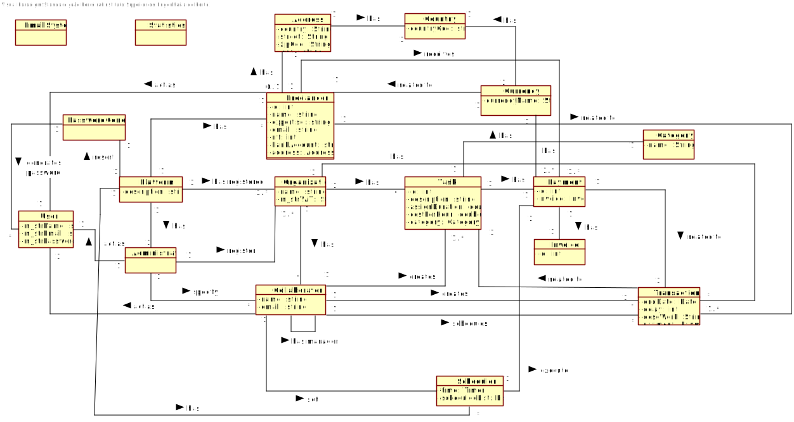

# OO Analysis

The process of building the domain model is based on use cases, especially the nouns used, and the description of the statement.

### _Category List_ ###

** Transactions (of the business) ** 

* __Task__
* __Payment Process__
---

** Products or services related to transactions **
* Transaction
* Task
* Freelancer

---

**Places**

*  Plataform

---

**Events**

* __Payment Process__
* __Sending email__

## ** Rational about identifying associations between classes ** ##

An association is a relationship between instances of objects that indicates a relevant connection and is worth remembering, or is derivable from the List of Common Associations:

+ A is physically (or logically) part of B
+ A is physically (or logically) contained in B
+ A is a description of B
+ A is known / captured / recorded by B
+ A uses or manages B
+ A is related to a B transaction
+ etc.
+ 

| Concept (A) 		|  Association   		|  Concept (B) |
|----------	   		|:-------------:		|------:       |
| Plataform			| has registered   | Organization  |
||has|Administrator|
||resort|PasswordGenerator|
||has|Scheduler|
|Organization|has|Collaborator|
||has|Task|
||has|Category|
|Administrator|register|Organization|
||specify|Collaborator|
||act as|User|
|Freelancer|receives|Payment|
||has|Address|
|Scheduler|execute|Payment|
|Currency|has|Country|
|Address|has|Country|
|Payment|has|Invoice|

## Domain Model

