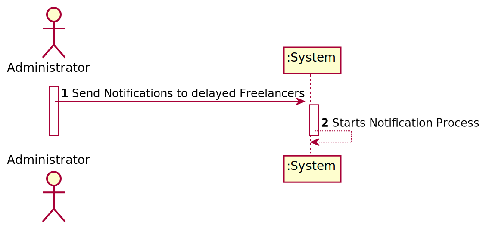
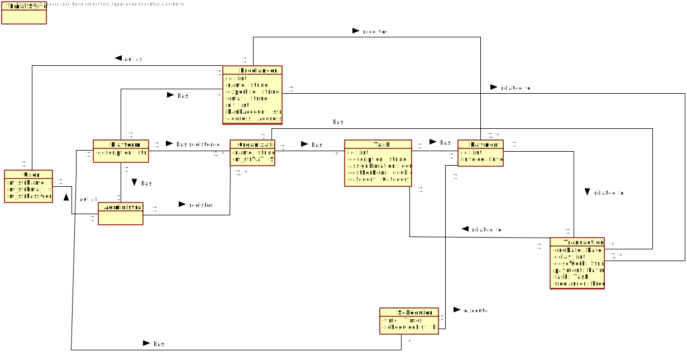
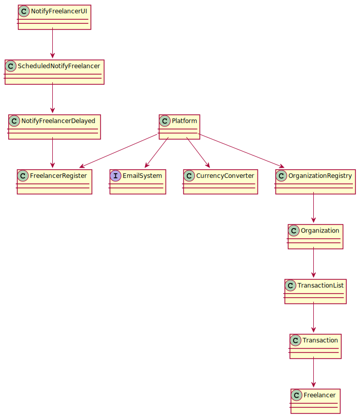

# UC10 - Schedule Notification to freelancers delayed

## 1. Requirements engineering

### Brief Format

### SSD

### Complete Format 

#### Main Actor 

Administrator

#### Main interested parts and their interests 
T4J - Wants to notify Freelancers with a certain percentage of delays 
#### Pre-requirements 
Previously Scheduled Date to send Notification 
#### Post-conditions
* Each Freelancer with a certain amount of delay  receives a notification
#### Main success scenario 

#### Special Requiremebs 

####  List of Variations, Technology, and data 

#### Occurrence Frequency

#### Open Questions

* Email Service choosen  in the start of the application?

## 2.OO Analysis 

### Domain submodel for the UC 

## 3. Design - Use Case execution

### Rational

| Main Flcu | Question : Which Class... | Answer  | Justification  |
|:--------------  |:---------------------- |:----------|:---------------------------- |
|1, Schedules a date to notify Feelancers Behind Schedules (String Date) |... interacts with ?| System timer ||
| || ||
| |||
|2. System schedules notifications o a given date ||||

             

### Systematization ##

 From the rational results he following conceptual classes

 * Platform 
 * EmailSystem
 * Organization
 * Transaction
 * Freelancer
 * EmailSystem 

###	Sequence Diagram

###	Class Diagram

Email System:

