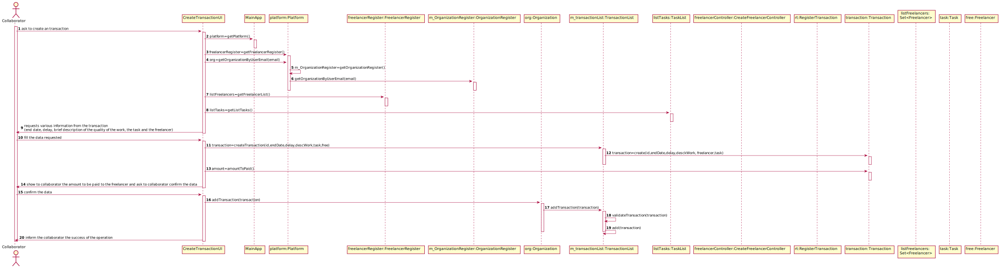

# UC1 - Create Transaction

## 1. Requirements Engineering 

### Brief Format

The collaborator of the organization ask to create an transaction. The system requests various information from the transaction (end date, delay, brief description of the quality of the work, the task and the freelancer). The collaborator fill the data requested. The system validates the data filled, show to collaborator the amount to be paid to the freelancer and ask to collaborator confirm the data. The collaborator confirm the data. The system register the transaction and inform the collaborator the success of the operation.

### SSD

### Full Format

#### Main Actor
* Organization collaborator

#### Interested parts and their interests
* Organization collaborator: want to create transaction.
* Organization: want your employees to be able to create transaction.
* T4J: intends to make transaction payments to freelancers. 

#### Pre-conditions
\-

#### Post-conditions
* The information for the new transaction is recorded in the system.

#### Main success scenario (or basic flow)

1. The collaborator of the organization ask to create an transaction. 
2. The system requests various information from the transaction (end date, delay, brief description of the quality of the work, the task and the freelancer). 
3. The collaborator fill the data requested. 
4. The system validates the data filled, show to collaborator the amount to be paid to the freelancer and ask to collaborator confirm the data. 
5. The collaborator confirm the data. 
6.  The system register the transaction and inform the collaborator the success of the operation.

#### Extensões (ou fluxos alternativos)

a. The organization collaborator requests the cancellation of the transaction.
> The use case ends.

3a. The collaborator doesn't find the task he wants.
> 1. The system allows the creation of a new task (UC 2). 
> 2. The collaborator fill the task information.
>
> 3. The organization collaborator doesn't create a new task. The use case ends.

3b. The collaborator doesn't find the freelancer he wants.
> 1. The system allows the creation of a new freelancer (UC 3). 
> 2. The collaborator fill the freelancer information.
>
> 3. The organization collaborator doesn't create a new freelancer. The use case ends.

4a. Missing minimum required data.
> 1. The system informs you which data is missing.
> 2. The system allows entry of missing data (step 3)
>
> 3. The organization collaborator doesn't change the data. The use case ends.

4b. The system detects that the data (or some subset of the data) entered must be unique and that it already exists in the system.
> 1. The system alerts the organization employee to the fact.
> 2. The system allows you to change it (step 3)
>
> 3. The organization collaborator does not change the data. The use case ends.

4c. The system detects that the entered data (or some subset of the data) is invalid.
> 1. The system alerts the organization employee to the fact.
> 2. The system allows you to change it (step 3)
>
> 3. The organization collaborator does not change the data. The use case ends.

#### Special Requirements
\-

#### List of Technologies and Data Variations
\-

#### Frequency of Occurrence
\-

#### Open Questions
\-

## 2. OO Analysis

### Excerpt from the Domain Model Relevant for the UC

## 3. Design - Use Case Realization

### Rational

|Main Flow | Question: What Class ... | Answer | Justification |
|:--------------  |:---------------------- |:----------|:---------------------------- |
|1. The collaborator of the organization ask to create an transaction |... interacts with the user?| CreateTransactionUI | Pure Fabrication |
| |... creates Transaction instance?| TransactionList| Creator (rule 1) + HC/LC|
||... creates Freelancer instance|CreateFreelancerController|Creator (rule 1) + HC/LC|
||... creates Task instance or |TaskList|Creator (rule 1) + HC|
|2. The system requests various information from the transaction (end date, delay, brief description of the quality of the work, the task and the freelancer) ||||
||... know the tasks of the organization? |TaskList|Creator (rule 1) + HC|
||... know the freelancers of the platform? |FreelancerRegister|IE + HC/LC|
|3. The collaborator fill the data requested |... save the data entered?|Transaction|IE|
|4. The system validates the data filled, show to collaborator the amount to be paid to the freelancer and ask to collaborator confirm the data|... calculate the total to be paid to the freelancer?|Transaction|HC + IE: The Transaction has the freelancer and the task|
||... validates Transaction data (local validation)|Transaction|IE|
||... validates Transaction data (global validation)|Transaction|IE|
|5. The collaborator confirm the data||||
|6. The system register the transaction and inform the collaborator the success of the operation|... saves the Transaction created?|TransactionList|IE: RegisterTransaction has all the Transactions|
### Systematization ##

It follows from the rational that the conceptual classes promoted to software classes are:

 * Transaction
 * Platform
 * Freelancer
 * Task
 * Organization
  
Other software classes (i.e. Pure Fabrication) identified: 

 * CreateTransactionUI
 * TransactionList
 * CreateFreelancerController
 * TaskList
 * FreelancerRegister
 * OrganizationRegister
 
Other classes of external systems / components:

 \-

### Sequence Diagram

### Class Diagram

