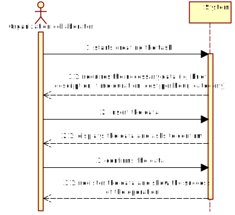
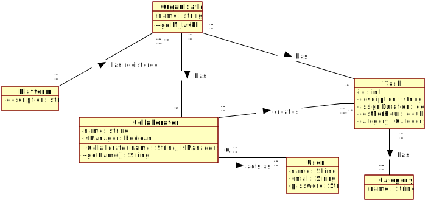
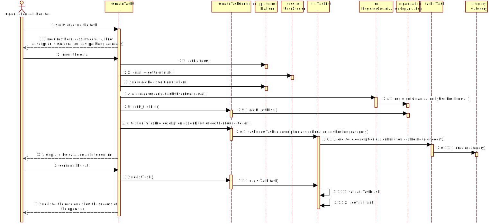
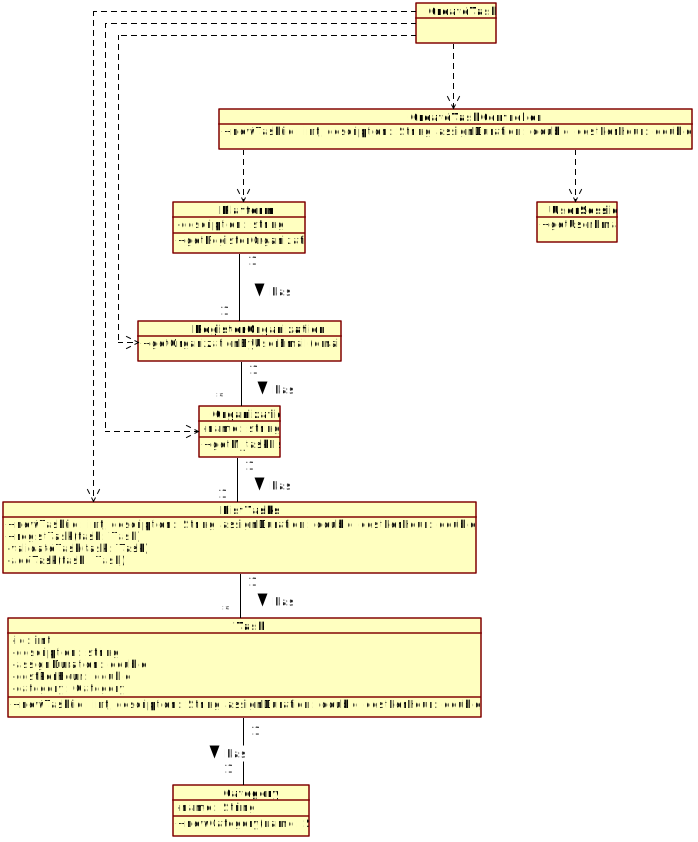

# UC2 - Create Task

## 1. Requirements Engineering 

### Brief Format

The organization collaborator starts creating the task. 
The system requires the necessary data (id, brief description, time duration (in hours), cost per hour (in euros), category). 
The organization collaborator insert the data.
The system displays the data and asks to confirm. 
The organization collaborator confirms the data. 
The system register the data and show the success of the operation.

### SSD

### Full Format

#### Main Actor
* Organization collaborator

#### Interested parts and their interests
* Organization collaborator: want to create tasks.
* Organization: want your employees to be able to create tasks.
* T4J: intends to make task payments to freelancers. 

#### Pre-conditions
\-

#### Post-conditions
* The information for the new task is recorded in the system.

#### Main success scenario (or basic flow)

1. The organization collaborator starts creating the task.  
2. The system requires the necessary data (id, brief description, time duration (in hours), cost per hour (in euros), category).
3. The organization collaborator insert the data. 
4. The system displays the data and asks to confirm. 
5. The organization collaborator confirms the data. 
6. The system register the data and show the success of the operation.

#### Extensões (ou fluxos alternativos)

a. The organization collaborator requests the cancellation of the task specification.
> The use case ends.

4a. Missing minimum required data.
> 1. The system informs you which data is missing.
> 2. The system allows entry of missing data (step 3)
>
> 2a. The organization collaborator doesn't change the data. The use case ends.

4b. The system detects that the data (or some subset of the data) entered must be unique and that it already exists in the system.
> 1. The system alerts the organization employee to the fact.
> 2. The system allows you to change it (step 3)
>
> 2a. The organization collaborator does not change the data. The use case ends.

4c. The system detects that the entered data (or some subset of the data) is invalid.
> 1. The system alerts the organization employee to the fact.
> 2. The system allows you to change it (step 3)
>
> 2a. The organization collaborator does not change the data. The use case ends.

#### Special Requirements
\-

#### List of Technologies and Data Variations
\-

#### Frequency of Occurrence
\-

#### Open Questions
\-

## 2. OO Analysis

### Excerpt from the Domain Model Relevant for the UC

## 3. Design - Use Case Realization

### Rational

|Main Flow | Question: What Class ... | Answer | Justification |
|:--------------  |:---------------------- |:----------|:---------------------------- |
| 1. The organization collaborator starts creating the task.	| ... interact with the user? | CreateTaskUI |  Pure Fabrication: it isn't justified to assign this responsibility to any existing class in the Domain Model. |
|  		 	| ... coordinates the UC?	| CreateTaskController	| Controller    |
|  		 	| ... creates a Task instance? | ListTasks | Creator (Rule1): + HC / LC: in the MD the Organization has a Task. By HC / LC delegates these responsibilities on TaskList. |
|			| ... do you know the user using the system? | UserSession | IE: documentation of the user management component. |
|			| ... do you know which organization the collaborator belongs to? | RegisterOrganization | IE: knows all organizations. |
|			|																	| Organization	| IE: know your employees.|
|			|																	| Collaborator	| IE: knows your data (e.g. email). |
| 2. The system requires the necessary data (id, brief description, time duration (in hours), cost per hour (in euros), category).| | | 
| 3. The organization collaborator insert the data.  		| ... save the data entered? | Task, Category | Information Expert (IE)- instance created in step 1: it has its own data. |
| 															| ... create/instantiate Category?  | Task | Creator (Rule1) |
| 4. The system displays the data and asks to confirm.    	| ... validates the Task data (local validation)? | Task | IE: has its own data. |  	
|	 														| ... validates the Task data (global validation)? | ListTasks | IE: the ListTasks has a Task. |
| 5. The organization collaborator confirms the data. | | | |
| 6. The system register the data and show the success of the operation. |	... saves the created Task? | ListTasks | IE: the ListTasks has a Task. |
|															| ... inform the organization collaborator? | CreateTaskUI | |

### Systematization ##

It follows from the rational that the conceptual classes promoted to software classes are:

 * Organization
 * Plataform
 * Task
 * Collaborator
 * Category

Other software classes (i.e. Pure Fabrication) identified: 

 * CreateTaskUI  
 * CreateTaskController
 * ListTasks
 * RegisterOrganization
 
Other classes of external systems / components:

 * UserSession

### Sequence Diagram

### Class Diagram

