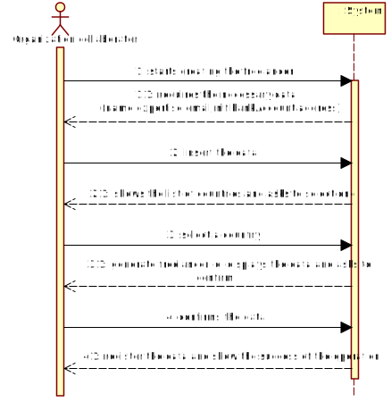
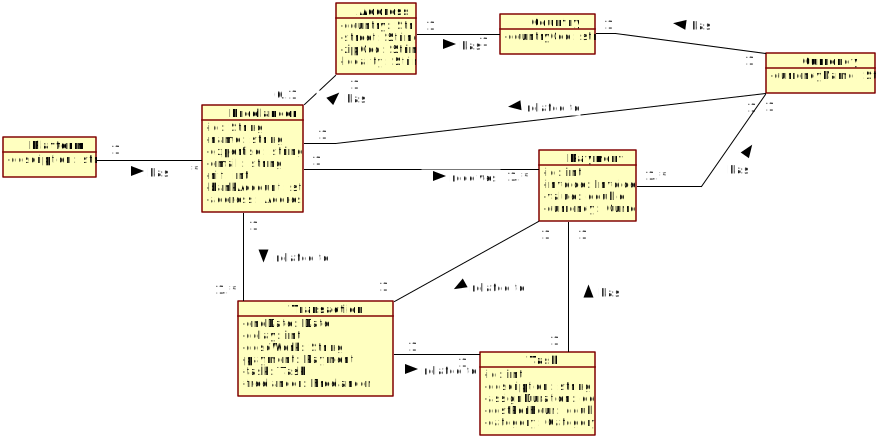
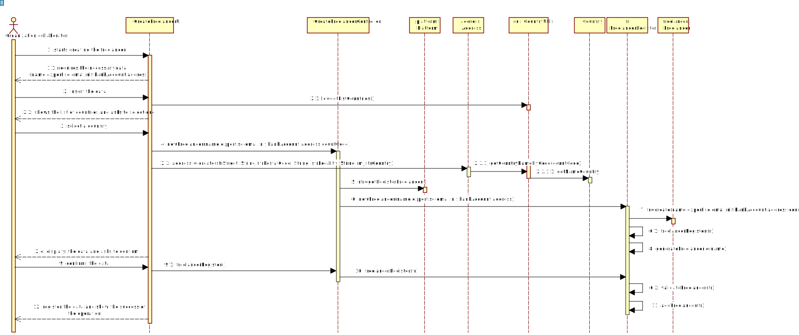
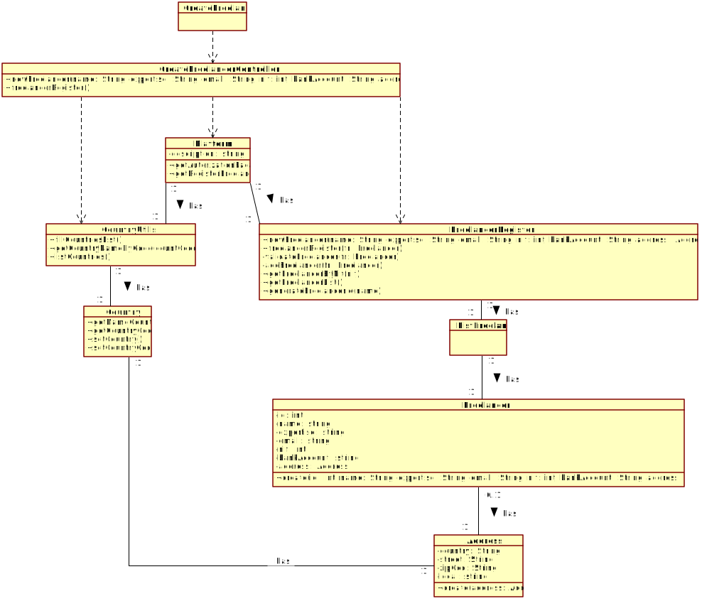

# UC3 - Create Freelancer

## 1. Requirements Engineering 

### Brief Format

The organization collaborator starts creating the freelancer.
The system requires the necessary data (name,expertise,email,nif,bankAccount,address,country).
The organization collaborator insert the data.
The system generate the id, displays and asks to confirm the data. 
The collaborator confirm the data.
The system register the data and show the success of the operation.

### SSD

### Full Format

#### Main Actor
* Organization collaborator

#### Interested Parties and Their Interests
* Organization collaborator: want to create freelancers.
* Organization: want your employees to be able to create freelancers.
* T4J: intends to create freelancers to make the payment. 

#### Pre-conditions
\-

#### Post-conditions
\-

#### Main success scenario (or basic flow)

1. The organization collaborator starts creating the freelancer. 
2. The system requires the necessary data (name,expertise,email,nif,bankAccount,address,country).
3. The organization collaborator insert the data. 
4. The system shows the list of countries and asks to select one.
5. The organization collaborator select a country.
6. The system generate the id, displays the data and asks to confirm.  
7. The collaborator confirm the data.
8. The system register the data and show the success of the operation.

#### Extensões (ou fluxos alternativos)

a. The organization collaborator requests the cancellation of the freelancer specification.
> The use case ends.

4a. Missing minimum required data.
> 1. The system informs you which data is missing.
> 2. The system allows entry of missing data (step 3)
>
> 2a. The organization collaborator doesn't change the data. The use case ends.

4b. The system detects that the data (or some subset of the data) entered must be unique and that it already exists in the system.
> 1. The system alerts the organization collaborator to the fact.
> 2. The system allows you to change it (step 3)
>
> 2a. The organization collaborator does not change the data. The use case ends.

4c. The system detects that the entered data (or some subset of the data) is invalid.
> 1. The system alerts the organization collaborator to the fact.
> 2. The system allows you to change it (step 3)
>
> 2a. The organization collaborator does not change the data. The use case ends.

4d. The system detects that the nif entered must be unique and that it already exists in the system.
> 1. The system alerts the organization manager to the fact.
> 2. The system allows you to change it (step 3).
>
>> 2a. The organization manager does not change the data. The use case ends.

#### Special Requirements
\-

#### List of Technologies and Data Variations
\-

#### Frequency of Occurrence
\-

#### Open Questions
\-

## 2. OO Analysis

### Excerpt from the Domain Model Relevant for the UC

## 3. Design - Use Case Realization

### Rational

|Main Flow | Question: What Class ... | Answer | Justification |
|:--------------  |:---------------------- |:----------|:---------------------------- |
| 1. The organization collaborator starts creating the freelancer.	| ... interact with the user? | CreateFreelancerUI |  Pure Fabrication: it isn't justified to assign this responsibility to any existing class in the Domain Model. |
|  		 	| ... coordinates the UC?	| CreateFreelancerController	| Controller    |
|  		 	| ... creates a Freelancer instance? | FreelancerRegister | Creator (rule1) combined with HC + LC on Platform. |
| 2. The system requires the necessary data (name,expertise,email,nif,bankAccount,address,country).| | |
| 3. The organization collaborator insert the data.  		| ... save the data entered? | Freelancer, Address | Information Expert (IE)- instance created in step 1 |
| 															| ... create/instantiate Address?  | Freelancer | Creator (Rule1) |
| 4. The system shows the list of countries and asks to select one. | ... know the list of countries?  |  CountryUtils  | CountryUtils owns all instances of Country |
|  | ... know the data about country?  |  Country  | IE: has its own data. |
| 5. The organization collaborator select a country. | ... save the selected country?	| Address | IE: has its own data. |
| 6. The system generate the id, displays the data and asks to confirm. | ... generates freelancer id? | FreelancerRegister | IE: the FreelancerRegister has a Freelancer. |
|																						| ... validate the Freelancer id? | FreelancerRegister | IE: the FreelancerRegister has a Freelancer. |
|																		| ... save the data? | FreelancerRegister | IE: has its own data. |
| | ... validates the Freelancer data (local validation)? | Freelancer | IE: has its own data. |   	
|	 														| ... validates the Freelancer data (global validation)? | FreelancerRegister | IE: the FreelancerRegister has a Freelancer. |
| 7. The organization collaborator confirms the data. | | | |
| 8. The system register the data and show the success of the operation. | ... saves the created Freelancer? | FreelancerRegister | IE: the FreelancerRegister has a Freelancer. |
|																						| ... inform the organization collaborator? | CreateFreelancerUI | |

### Systematization ##

It follows from the rational that the conceptual classes promoted to software classes are:

 * Plataform
 * Freelancer
 * Address
 * Country

Other software classes (i.e. Pure Fabrication) identified: 

 * CreateFreelancerUI  
 * CreateFreelancerController
 * RegisterCountries
 * FreelancerRegister
 * CountryUtils

### Sequence Diagram

### Class Diagram

