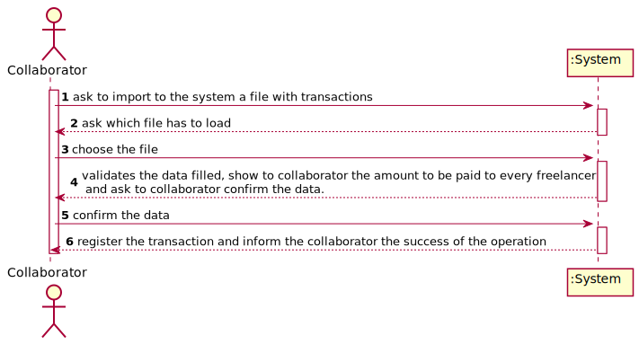
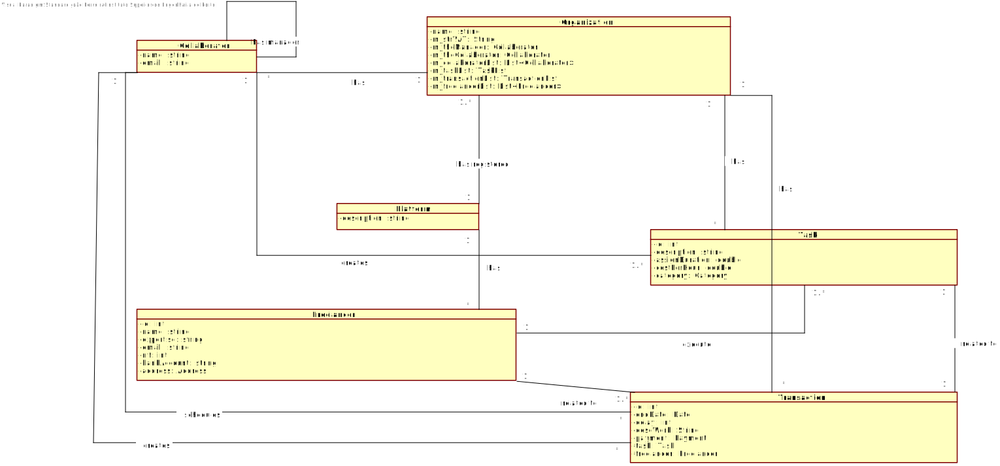
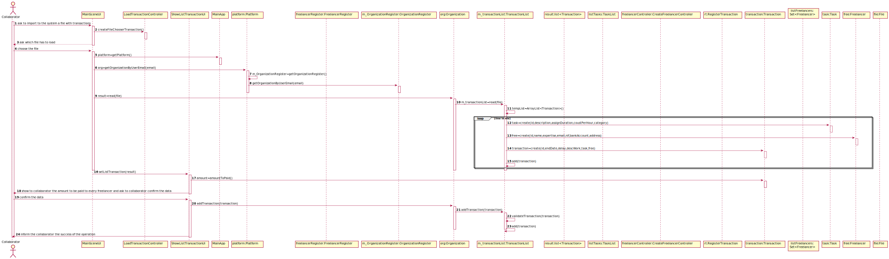
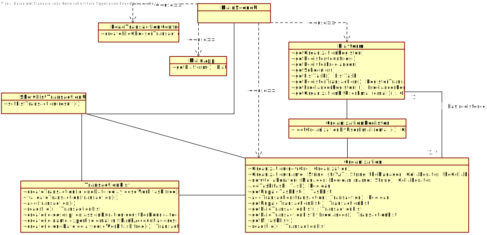

# UC4 - Load Transaction

## 1. Requirements Engineering 

### Brief Format

The collaborator ask to import to the system a file with transactions. The system ask which file has to load. The collaborator choose the file. The system validates the data filled, show to collaborator the amount to be paid to every freelancer and ask to collaborator confirm the data.  The collaborator confirm the data. The system register the transaction and inform the collaborator the success of the operation.

### SSD

### Full Format

#### Main Actor
* Organization collaborator

#### Interested parts and their interests
* Organization collaborator: want to create tasks.
* Organization: want your employees to be able to create tasks.
* T4J: intends to make task payments to freelancers. 

#### Pre-conditions
\-

#### Post-conditions
* The information for the new task is recorded in the system.

#### Main success scenario (or basic flow)

1. The collaborator ask to import to the system a file with transactions. 
2. The system ask which file has to load. 
3. The collaborator choose the file. 
4. The system validates the data filled, show to collaborator the amount to be paid to every freelancer and ask to collaborator confirm the data.  
5. The collaborator confirm the data. 
6. The system register the transaction and inform the collaborator the success of the operation.

#### Extensões (ou fluxos alternativos)

*a. The collaborator cancels the task registration.
> 	1. The use case ends.

4a. The file choosed does not exist.
>	1. The system informs the collaborator.
>	2. The system allow the collaborator to choose a new file. (step 3)
>
	>	2a. The collaborator does not choose a new file. The use case ends.

4b. The data introduced already exists in the system.
>	1. The system informs the collaborator.
>	2. The system allow the collaborator to introduce a new data. (step 3)
>
	>	2a. The collaborator does not change the data introduced. The use case ends.

4c. The system detects missing data.
>	1. The system informs the collaborator.
>	2. The system allow the collaborator to choose a new file. (step 3)
>
	>	2a. The collaborator does not choose a new file. The use case ends.

#### Special Requirements
\-

#### List of Technologies and Data Variations
\-

#### Frequency of Occurrence
\-

#### Open Questions
\-

## 2. OO Analysis

### Excerpt from the Domain Model Relevant for the UC

## 3. Design - Use Case Realization

### Rational

|Main Flow | Question: What Class ... | Answer | Justification |
|:--------------  |:---------------------- |:----------|:---------------------------- |
|1. The collaborator ask to import to the system a file with transactions |... interacts with the user?| MainSceneUI | Pure Fabrication |
| |... coordinates the UC?| LoadTransactionController | Controller |
|2. The system ask which file has to load||||
|3. The collaborator choose the file|... open a file with transactions?|TransactionList| Pure Fabrication|
||... creates a Task instance?| TaskList | Creator (Rule1): + HC / LC: in the MD the Organization has a Task. By HC / LC delegates these responsibilities on TaskList. |
||... save the Task?|TaskList|IE|
|| ... creates a Freelancer instance? | FreelancerRegister | Creator (rule1) combined with HC + LC on Platform. |
||... save the Freelnacer?|FreelancerRegister|IE|
||... creates Transaction instances?| TransactionList| Creator (rule 1) + HC/LC|
||... save the Transaction?|TransactionList|IE|
|4. The system validates the data filled, show to collaborator the amount to be paid to every freelancer and ask to collaborator confirm the data|... calculate the total to be paid  to every freelancer?|Transaction|HC + IE: The Transaction has the freelancer and the task|
||... validates Task data (local validation)|Task|IE|
||... validates Task data (global validation)|TaskList|IE|
||... validates Freelnacer data (local validation)|Freelnacer|IE|
||... validates Freelnacer data (global validation)|FreelancerRegister|IE|
||... validates Transaction data (local validation)|Transaction|IE|
||... validates Transaction data (global validation)|TransactionList|IE|
||... creates a temporary list of transactions|MainSceneUI|Fabrication|
||... calculate the total to be paid to the freelancer?|Transaction|HC + IE: The Transaction has the freelancer and the task|
|5. The collaborator confirm the data| ... interacts with the user?|ShowListTransactionUI|Pure Fabrication|
|6. The system register the transaction and inform the collaborator the success of the operation|... saves the Task created?|ListTasks|IE: ListTasks has all the Task|
||... saves the Freelnacer created?|FreelancerRegister|IE: FreelancerRegister has all the Freelnacer|
||... saves the Task created?|TaskList|IE: TaskList has all the Task|
||... saves the Transaction created?|TransactionList|IE: TransactionList has all the Transaction|

### Systematization ##

It follows from the rational that the conceptual classes promoted to software classes are:

 * Transaction
 * Platform
 * Freelancer
 * Task
 * Organization

Other software classes (i.e. Pure Fabrication) identified: 

 * MainSceneUI
 * LoadTransactionController
 * TransactionList
 * TaskList
 * FreelancerRegister
 * ShowListTransactionUI

Other classes of external systems / components:

 \-

### Sequence Diagram

### Class Diagram

