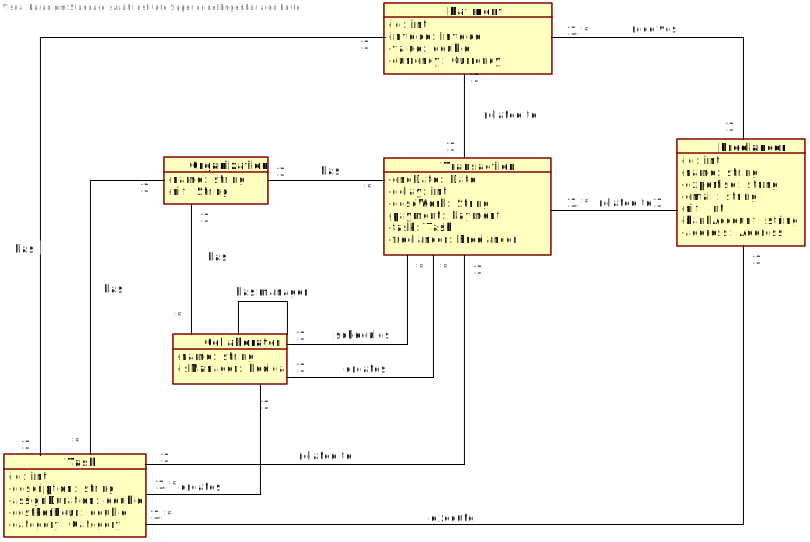
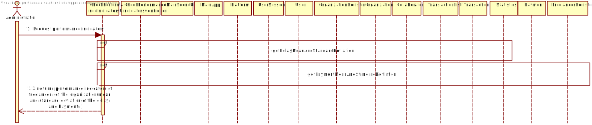
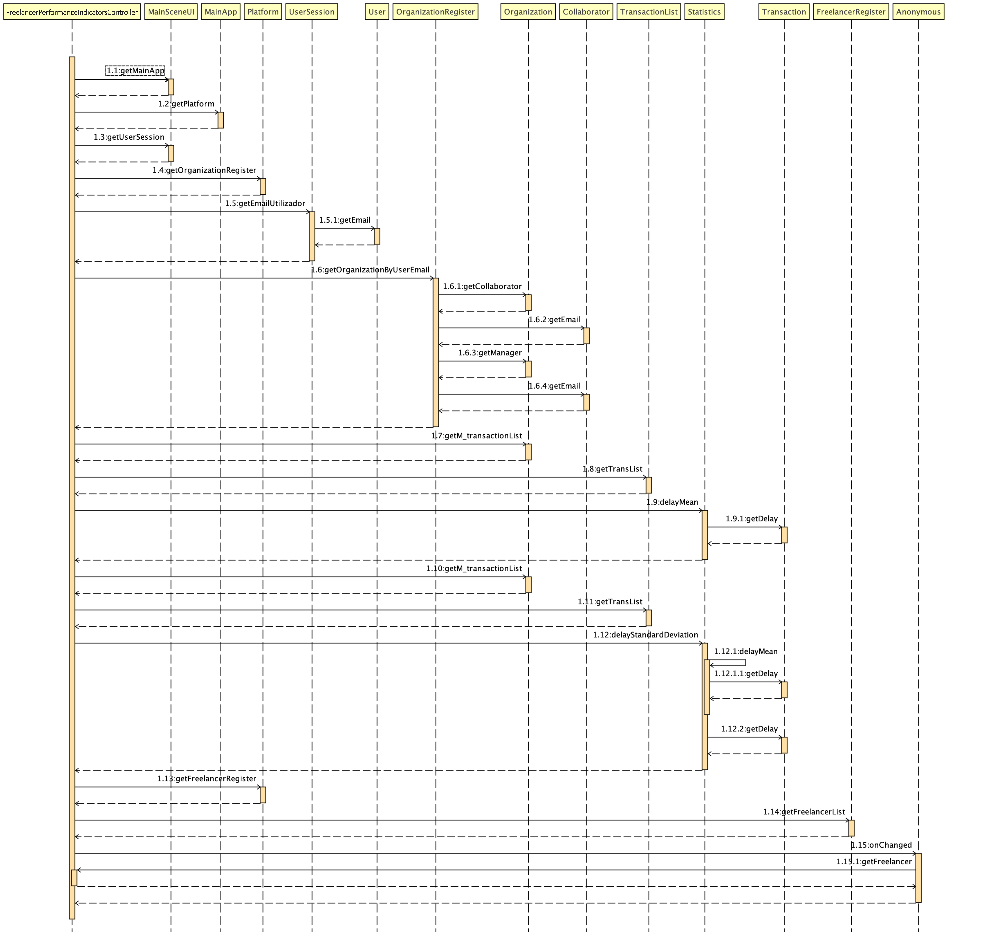
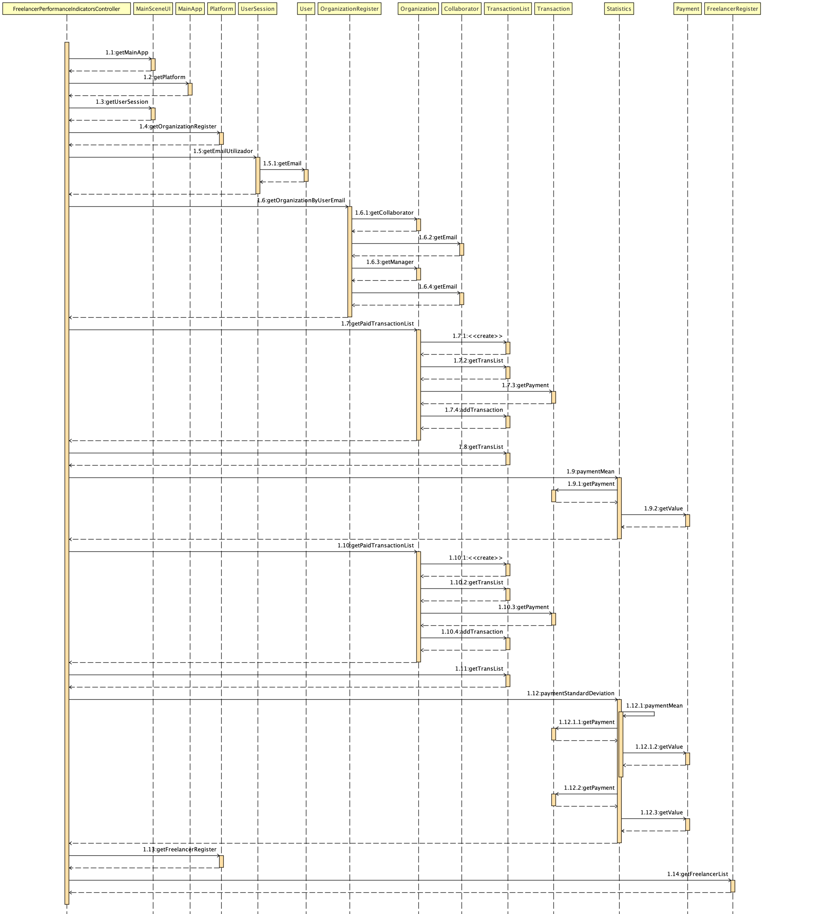
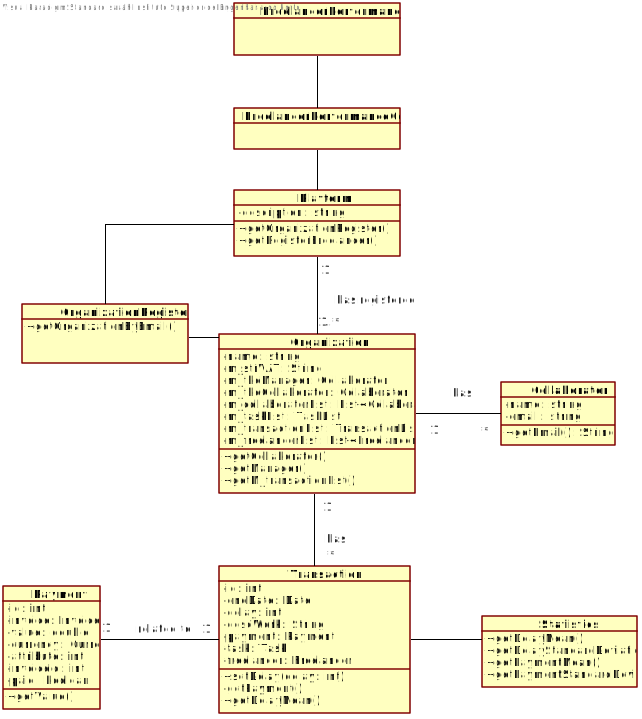

# UC5 - Check performance indicators

## 1. Requirements Engineering

### Brief Format

The manager or the collaborator of the organization request to see the freelancers performance indicators. The system shows the "Task execution times" indicators (mean and standard deviation of the delays, of each one and of all freelancers) and the "Freelancer payments" indicators (mean and standard deviation of the payments made to each one of the freelancers).

### SSD

### Full Format

#### Main Actor

Collaborator of the organization (manager and/or collaborator)

#### Interested Parties and Their Interests

* **Organization:** Have the possibility to check the performance indicators of the freelancers that performs their tasks.
* **T4J:** Give the oportunity to the organizations to get statistical information about their activity.

#### Pre-conditions
The collaborator (manager and collaborator) should be registred in the platform.
The tasks should be registred in the platform.

#### Post-conditions
-

#### Main success scenario (or basic flow)

1. The manager or the collaborator of the organization request to see the freelancers performance indicators.
2. The system shows the Task execution times"performance indicators of the freelancers (mean and standard deviation of the delays, of each one and of all freelancers) and the "Freelancer payments" indicators of the freelancers (mean and standard deviation of the payments made to each one of the freelancers).

#### Extensions (or alternative flows)

*a. The collaborator cancels the visualisation of statistical information.
> 	1. The use case ends.

2a. There is no information available in the platform about freelancer's task execution times for the collabortator's organisation.
>	1. The system informs the collaborator.
	>	1a. The use case ends.

2a. There is no information available in the platform about freelancer's payments for the collabortator's organisation.
>	1. The system informs the collaborator.
		>	1a. The use case ends.*

#### Special Requirements
\-

#### List of Technologies and Data Variations
\-

#### Frequency of Occurrence
\-

#### Open Questions
-

## 2. OO Analysis

### Excerpt from the Domain Model Relevant for the UC

## 3. OO Design - Use Case

### Rational

|Main Flow | Question: What Class ... | Answer | Justification |
|:--------------  |:---------------------- |:----------|:---------------------------- |
|1. The administrator requests the freelancers performance statistics.|... interacts with the user?| FreelancerStatisticUI | Pure Fabrication |
| |... coordinates the UC?| FreelancerStatisticController | Controller |
| |... creates Statistics instances?| Platform | Creator (rule 1) |
| |... knows the organization| OrganizationRegister | IE + HC LC |
| |... knows the freelancers| FreelancerRegister | IE + HC LC |
| |... knows the transactions| TransactionList | IE |
| |... knows the if the transaction is payed| Transaction | IE |
|2. The system shows the Task execution times"performance indicators of the freelancers (mean and standard deviation of the delays, of each one and of all freelancers) and the "Freelancer payments" indicators of the freelancers (mean and standard deviation of the payments made to each one of the freelancers). |...informs the collaborator? | FreelancerPerformanceIndicatorsUI | |

### Systematization ##

It follows from the rational that the conceptual classes promoted to software classes are:

* platform
* Oganization
* Statistics
* Transaction
* Payment

 Other software classes(i.e. Pure Fabrication) identified:

 * FreelancerPerformanceIndicatorsUI
 * FreelancerPerformanceIndicatorsController

###	Sequence Diagram

* getDelayMeanAndStandardDeviation

* getPaymentMeanAndStandardDeviation

###	Classes Diagram

