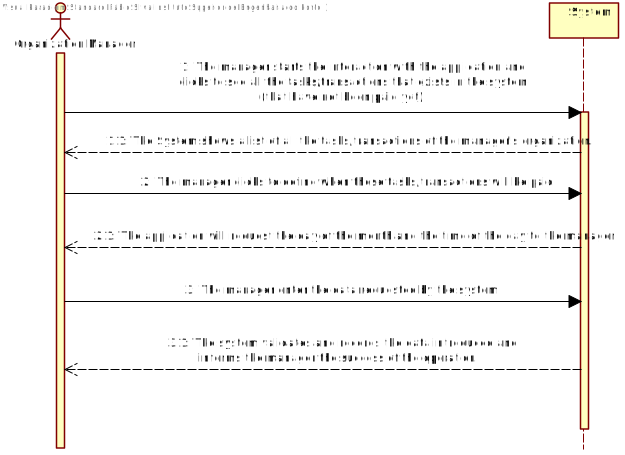
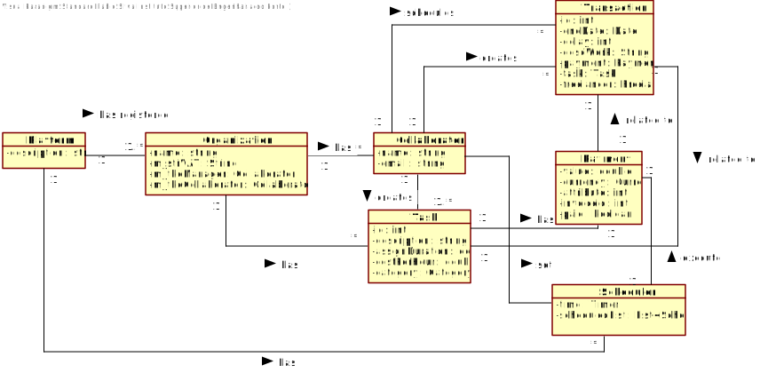
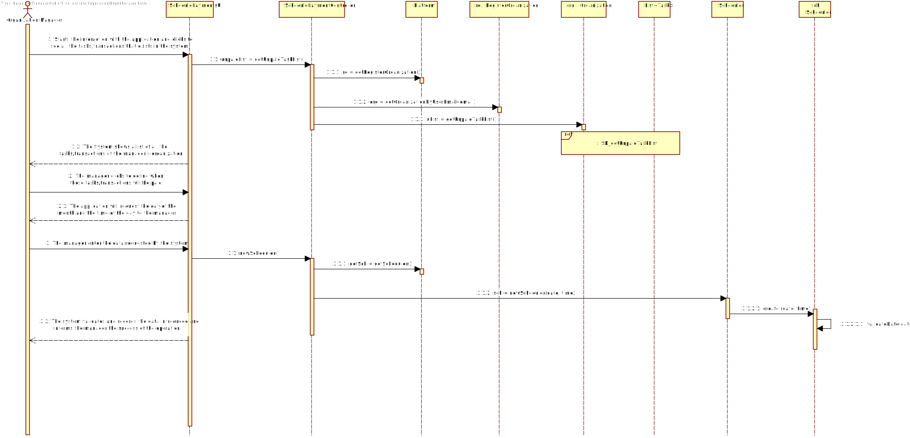
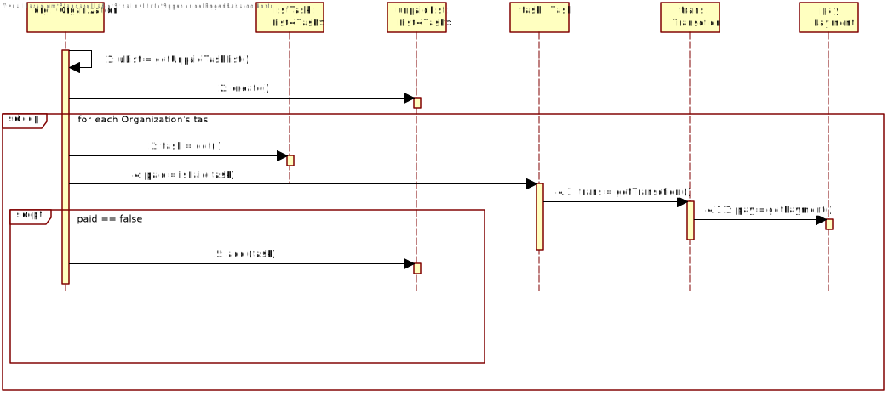
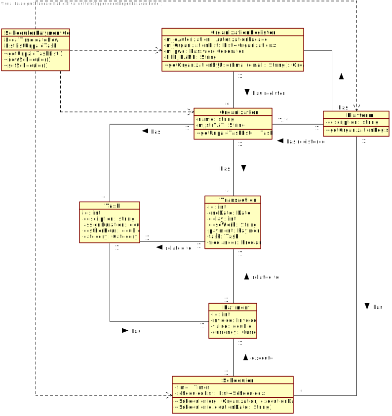

# UC6 - Scheduling Payments

## 1. Requirements Engineering 

### Brief Format

The manager of an organization wants to use the application to define all the tasks/transactions, that exist in the system and that have not been paid yet, will be paid. The manager starts the interaction with the application and clicks to see all the tasks/transactions that exists in the system (that have not been paid yet). The system shows a list of all the tasks/transactions of the manager's organization. The manager clicks to define when those tasks/transactions will be paid. The system will request the day of the month and the time of the day to the manager. The manager enter the data requested by the system. The system validates and asks to the manager to confirm. The manager confirms. The system records the data introduced and informs the manager the success of the operation. 

### SSD

### Full Format

#### Main Actor

Organization Manager

#### Interested Parties and Their Interests

* **Organization's Manager:** Someone who acts on behalf of the registed organization. Among other responsabilities, its his duty to schedule the payments of the tasks.
* **T4J:** Wants the Organization's managers to be able to define the tasks/transactions payments. 

#### Pre-conditions

The organization and its manager are registered in the system.
The existence of unpaid tasks/transactions of the organization in the system. 

#### Post-conditions

The payment schedule is registered on the system.

#### Main success scenario (or basic flow)

1. The manager starts the interaction with the application and clicks to see all the tasks/transactions that exists in the system (that have not been paid yet). 
2. The system shows a list of all the tasks/transactions of his organization. 
3. The manager clicks to define when those tasks/transactions will be paid. 
4. The system requests the day of the month and the time of the day to the manager. 
5. The manager enter the data requested by the system.
6. The system validates and asks to the manager to confirm. 
7. The manager confirms.
8. The system records the data introduced and informs the manager the success of the operation. 

#### Extensões (ou fluxos alternativos)

*a. The organization manager cancels the payments scheduling.

> 	1. The use case ends.

6a. The date introduced is before than the actual date.
>	1. The system informs the manager.
>	2. The system allow the manager to introduce a new date. (step 5)
>
	>	2a. The manager does not change the date. The use case ends.
	
6b. The date introduced is before than the execution finish date of one task of the list.
>	1. The system informs the manager about this issue.
>	2. The system allow the manager to introduce a new date. (step 5)
>
	>	2a. The manager does not change the date. The use case ends.

#### Special Requirements
\-

#### List of Technologies and Data Variations
\-

#### Frequency of Occurrence
\-

#### Open Questions
\-

## 2. OO Analysis

### Excerpt from the Domain Model Relevant for the UC

## 3. OO Design - Use Case

### Rational

| Main Flow | Question: Which Class... | Answer  | Justification  |
|:--------------  |:---------------------- |:----------|:---------------------------- |
|1. The manager starts the interaction with the application and clicks to see all the tasks/transactions that exists in the system (that have not been paid yet).|... interacts with the user?| SchedulePaymentsUI | Pure Fabrication |
| |... coordinates the UC?| SchedulePaymentController | Controller |
| |... knows that the task is unpaid?| Task | IE: Task owns the information about the payment |
|2. The system shows a list of all the tasks/transactions of his organization. |...records the tasks list? | Organization | IE: According to domain model, Organization has Task |
| | ... knows the manager's Organization? | RegisterOrganization | HC + LC: RegisterOrganization register Organization | 
|3. The manager clicks to define when those tasks/transactions will be paid. ||||
|4. The system requests the day of the month and the time of the day to the manager. ||||
|5. The manager enter the data requested by the system. ||||
| | ...validates the day and month? | Scheduler | IE: Scheduler has the information |
|6. The system validates and asks to the administrator to confirm. |...will register the day and time for scheduling?| Scheduler | IE: According to domain model, Collaborator sets a Scheduler to execute a payment. |
|7. The administrator confirms. ||||
|8. The system records the data introduced and informs the manager the success of the operation. ||||

             

### Systematization ##

It follows from the rational that the conceptual classes promoted to software classes are:

 * Platform
 * Organization
 * Collaborator
 * Task
 * Payment
 * Transaction
 * Scheduler

 Other software classes(i.e. Pure Fabrication) identified:

 * SchedulePaymentUI  
 * SchedulePaymentController

###	Sequence Diagram

###	Classes Diagram

