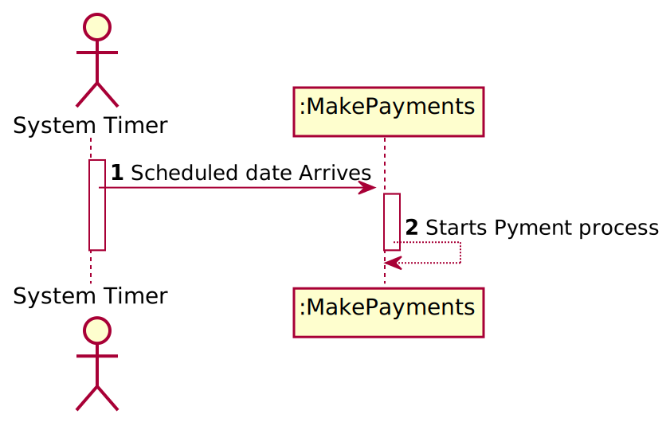
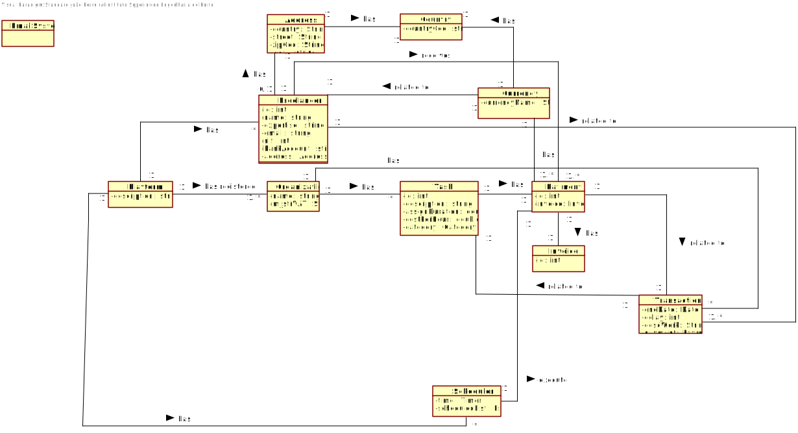
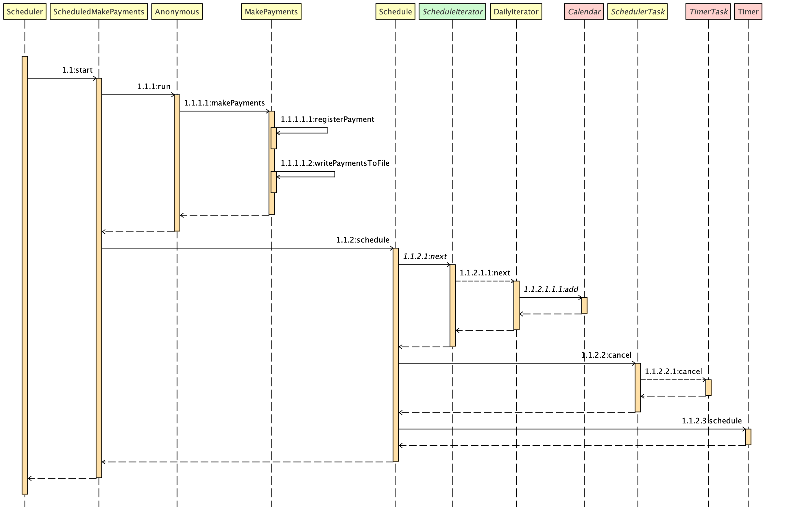
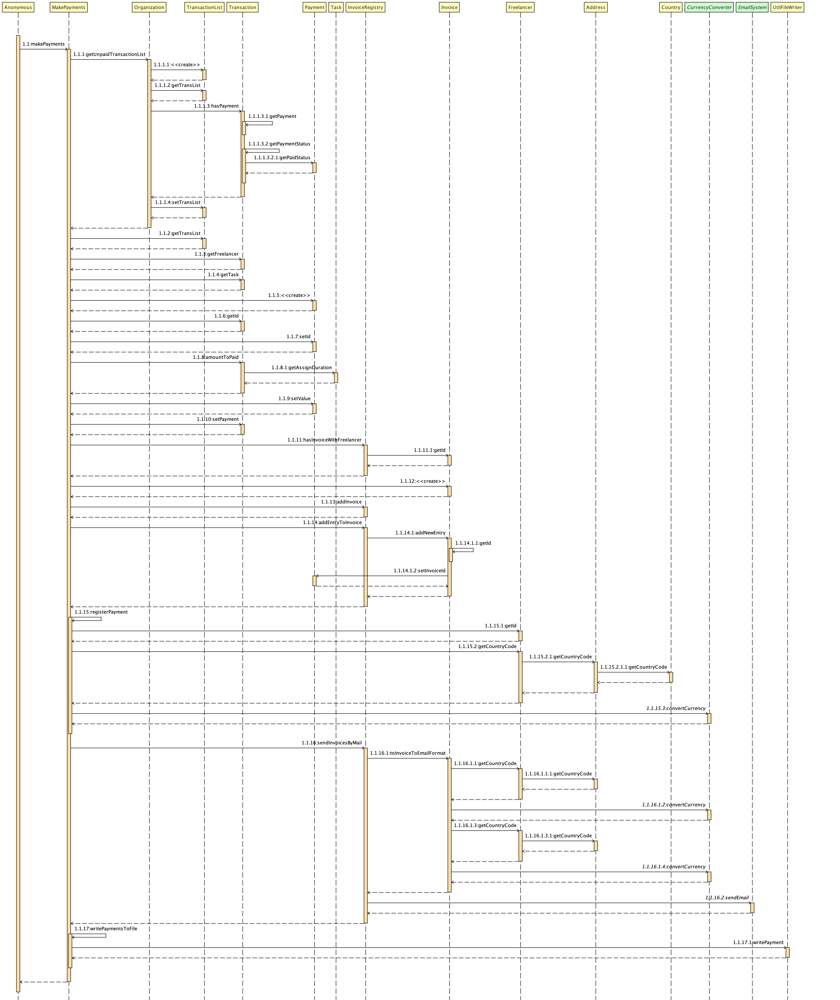
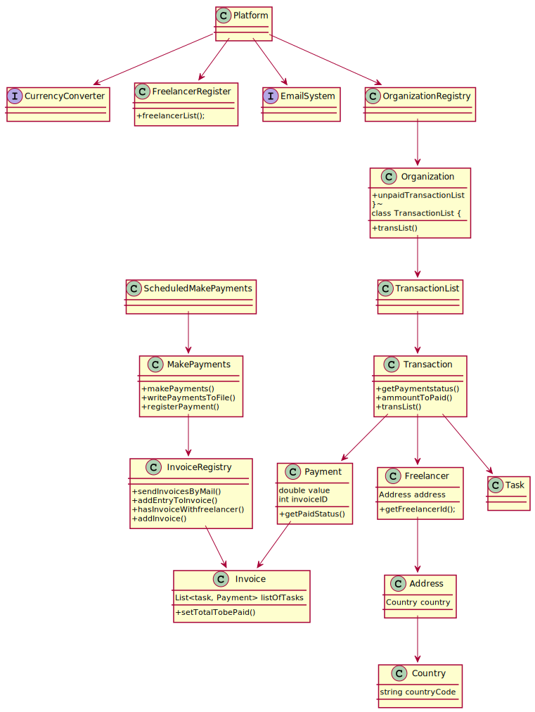
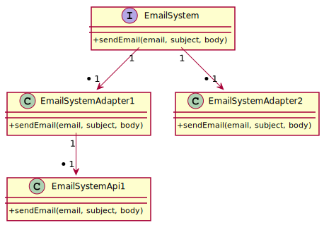

# UC7 - Make Payments

## 1. Requirements engineering

### Brief Format

### SSD

### Complete Format 

#### Main Actor 

System

#### Main interested parts and their interests 

#### Pre-requirements 
Previously Scheduled Date 
#### Post-conditions
* Each Frelancer Receives an Email wit Invoice details
#### Main success scenario 

1. step 
2. step

#### Special Requiremebs 

####  List of Variations, Technology, and data 

#### Occurrence Frequency

#### Open Questions

* Email Service choosen  in the start of the application?

## 2.OO Analysis 

### Domain submodel for the UC 

## 3. Design - Use Case execution

### Rational

| Main Flcu | Question : Which Class... | Answer  | Justification  |
|:--------------  |:---------------------- |:----------|:---------------------------- |
|1. Scheduled Date arrives |... interacts with ?| System timer ||
| || ||
| |||
|2. System starts payment process||||
|3. Payment is generated and Email withInvoice is sent to Freelancer |... interacts with ?| Platform ||

             

### Systematization ##

 From the rational results he following conceptual classes

 * Platform 
 * Emailystem
 * Organization
 * Transaction
 * Task
 * Payment 
 * Invoice
 * Freelancer
 * Address
 * Country
 * EmailSystem 
 * CurrencyConverter

###	Sequence Diagram

###	Class Diagram

Currency Convereter

Email System:

