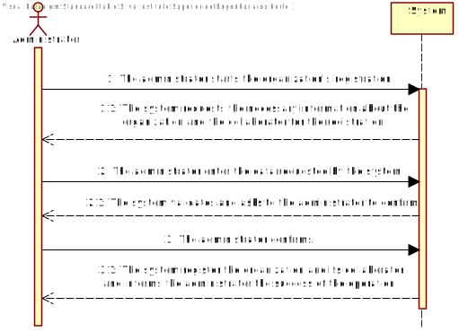
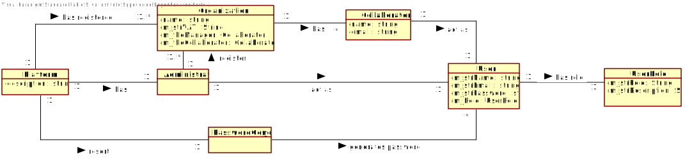
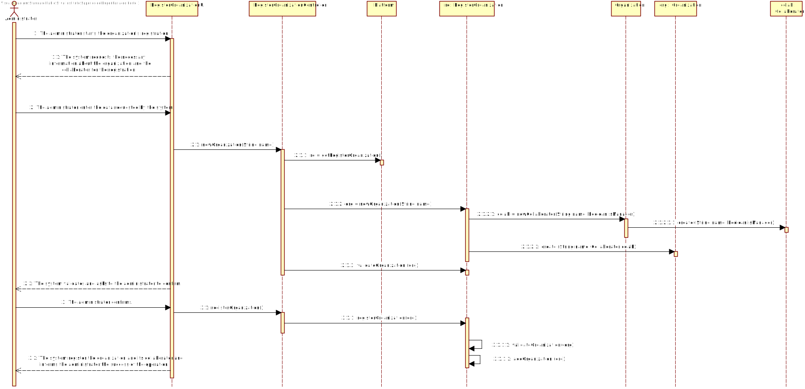
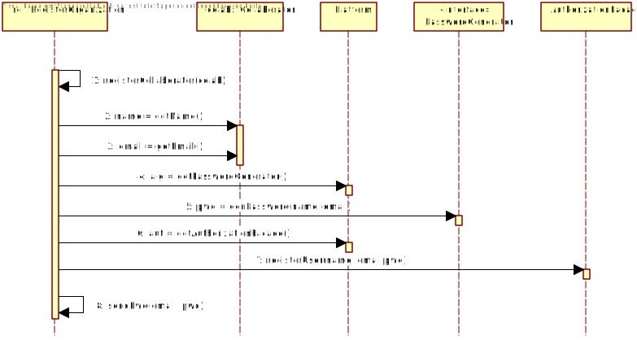
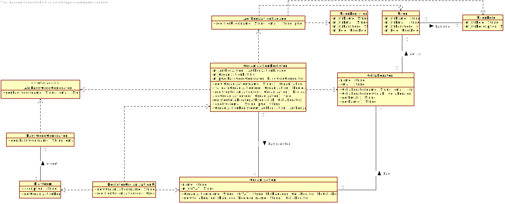

# UC1 - Organization Register

## 1. Requirements Engineering 

### Brief Format

The administrator starts the organization's registration. The system requests the necessary information about the organization and the collaborator for the registration. The administrator enter the data requested by the system. The system validates and asks to the administrator to confirm. The administrator confirms. The system register the organization and its collaborator and informs the administrator the success of the operation.

### SSD

### Full Format

#### Main Actor

Administrator

#### Interested Parties and Their Interests

* **Administrator:** Someone who acts on behalf of the T4J platform. Among other responsabilities, its his duty to register organizations.
* **T4J:** Wants the Administrator to be able to register organizations. 

#### Pre-conditions

The organization and the specified collaborator are not registered in the system. 

#### Post-conditions

The organization and the collaborator are registered on the system.

#### Main success scenario (or basic flow)

1. The administrator starts the organization's registration.
2. The system requests the necessary information about the organization and the collaborator for the registration. 
3. The administrator enter the data requested by the system. 
4. The system validates and asks to the administrator to confirm.
5. The administrator confirms. 
6. The system register the organization and its collaborator and informs the administrator the success of the operation.

#### Extensões (ou fluxos alternativos)

*a. The administrator cancels the organization registration.

> 	1. The use case ends.

4a. The data introduced already exists in the system.
>	1. The system informs the manager.
>	2. The system allow the administrator to introduce a new data. (step 3)
>
	>	2a. The administrator does not change the data introduced. The use case ends.

#### Special Requirements
\-

#### List of Technologies and Data Variations
\-

#### Frequency of Occurrence
\-

#### Open Questions
 * Are there any other mandatory data in addition to those already known?
 * Is there any security rules applyed to the password?
 * When adding collaborator, are there any other mandatory data in addition to those already known?
 * Is only one manager by organization?

## 2. OO Analysis

### Excerpt from the Domain Model Relevant for the UC

## 3. OO Design - Use Case

### Rational

| Main Flow | Question: Which Class... | Answer  | Justification  |
|:--------------  |:---------------------- |:----------|:---------------------------- |
|1. The administrator starts the organization's registration.|... interacts with the user?| RegisterOrganizationUI | Pure Fabrication |
| |... coordinates the UC?| RegisterOrganizationController | Controller |
| |... creates Organizacao instances?| Plataforma | Creator (rule 1) |
|2. The system requests the necessary information about the organization and the collaborator for the registration. ||||
|3. The administrator enter the data requested by the system. |... records the introduced data?| Organization, Collaborator |IE: instances created in step 1|
| |... creates Collaborator instances? | Organization | Creator (rule 1) |
|4. The system validates and asks to the administrator for confirmation. |... validates Organization's data? (local validation)| Organization |IE: owns the data |
| |... validates Collaborator's data? (local validation)| Collaborator |IE: owns the data |
| |... validates Organization's data? (global validation)| Platform | IE: Platform has registered Organization |
|5. The administrator confirms. ||||
|6. The system register the organization and its collaborator and informs the administrator the success of the operation. |... records Organization?| Platform | IE: According to the domain model, Platform has Organization |
| |... record Collaborator? | Organization | IE: According to the domain model, Organization has Collaborator |
             

### Systematization ##

It follows from the rational that the conceptual classes promoted to software classes are:

 * Platform
 * Administrator
 * Organization
 * Collaborator

 Other software classes(i.e. Pure Fabrication) identified:

 * RegisterOrganizationUI  
 * RegisterOrganizationController

###	Sequence Diagram

###	Classes Diagram

