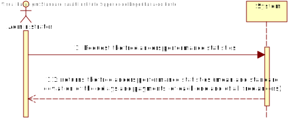
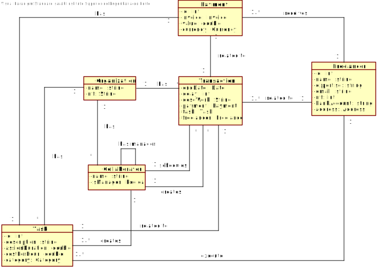
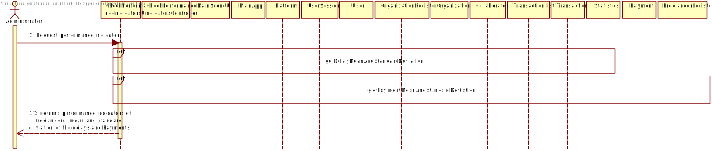
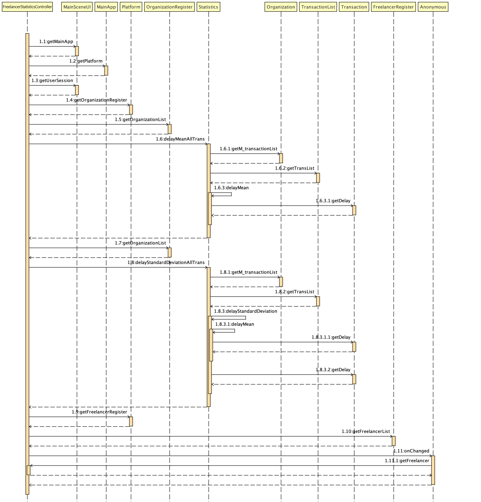
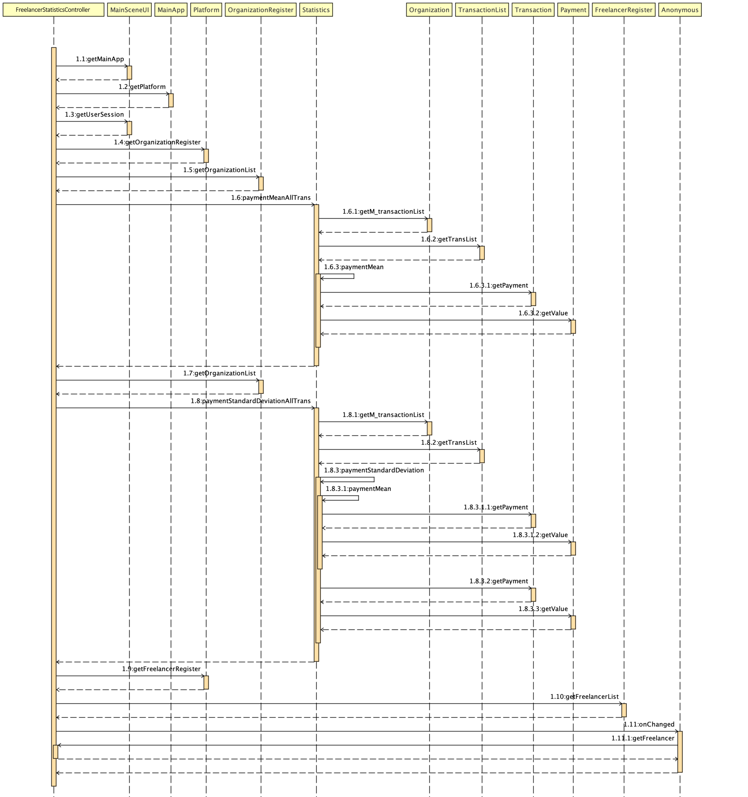
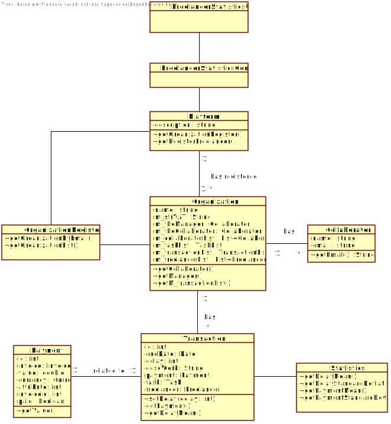

# UC 9 - Performance of the freelancers

## 1. Requirements Engineering

### Brief Format

The administrator requests the freelancers performance statistics.
The system calculates and shows the mean and standard deviation of the delays and payments, of each one and of all freelancers and show the probability that the sample mean is higher than 3 hours.

### Full Format

#### Main actor

* T4J Administrator

#### Stakeholders and their interests

* Administrator: Enables the administrator to analyse the freelancer's performance.
* T4J: Allows the platform to get a overview of the performance quality of its users.

#### Preconditions
* There is at least one task execution to be calculated by the system.
* There is at least one task execution with a delay time.

#### Post-conditions

-

#### Main success scenario (or basic flow)

1. The administrator requests the freelancers performance statistics.
2. The system calculates and shows the mean and standard deviation of the delays and payments, of each one and of all freelancers and show the probability that the sample mean is higher than 3 hours).

#### Extensions (or alternative flows)

1a. The administrator requests that the probability calculation be canceled.
> The use case ends.

1b. There are no completed tasks in the system.
> The use case ends.

#### Special requirements

\-

#### List of Technologies and Data Variations

\-

#### Frequency of Occurrence

\-

#### Open questions

## 2. Analysis OO

### Excerpt from the Relevant Domain Model for UC

## 3. Design - Use Case Realization

### Rational

|Main Flow | Question: What Class ... | Answer | Justification |
|:--------------  |:---------------------- |:----------|:---------------------------- |
|1. The administrator requests the freelancers performance statistics.|... interacts with the user?| FreelancerStatisticUI | Pure Fabrication |
| |... coordinates the UC?| FreelancerStatisticController | Controller |
| |... creates Statistics instances?| Platform | Creator (rule 1) |
| |... knows the organization| OrganizationRegister | IE + HC LC |
| |... knows the freelancers| FreelancerRegister | IE + HC LC |
| |... knows the transactions| TransactionList | IE |
| |... knows the if the transaction is payed| Transaction | IE |
|2. The system calculates and shows the mean and standard deviation of the delays and payments, of each one and of all freelancers and show the probability that the sample mean is higher than 3 hours. |...informs the administrator? | FreelancerStatisticUI | |

### Systematization ##

It follows from the rational that the conceptual classes promoted to software classes are:

 * platform
 * Oganization
 * Statistics
 * Transaction
 * Payment

Other software classes (i.e. Pure Fabrication) identified:

 * FreelancerStatisticUI
 * FreelancerStatisticController

### Sequence Diagram

* getDelayMeanAndStandardDeviation.

* getPaymentMeanAndStandardDeviation

### Class Diagram

